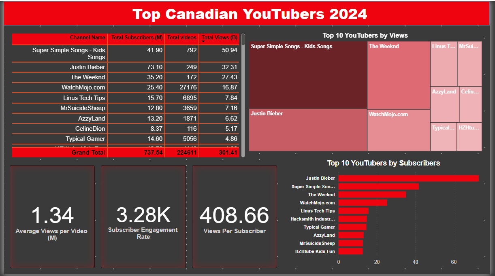
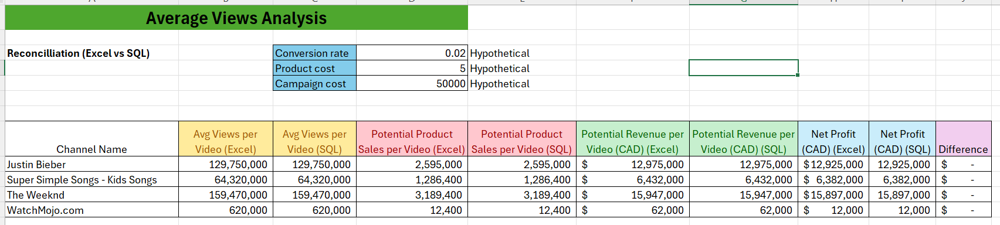

# Top Influential Canadian YouTubers Analysis


# Table of contents
- [Overview](#Overview)
- [Problem Statement](#Problem-Statement)
- [Business Case](#Business-Case)
- [Data Sources](#Data-Sources)
- [Project Stages](#Project-Stages)
  - [Development](#Development)
    - [Data Exploration](#Data-Exploration)
    - [Data Cleaning](#Data-Cleaning)
  - [Testing](#Testing)
  - [Visualization](#Visualization)
  - [Analysis](#Analysis)
  - [Recommendation](#Recommendation)
- [Tools Used](#Tools-Used)
- [Files Included](#Files-Included)
- [How to Use](#How-to-Use)

## Overview  
This data analysis project aims to identify and analyze the top influential Canadian YouTubers to facilitate marketing collaborations. The primary objective of the dashboard is to provide a comprehensive and user-friendly interface to discover the top-performing Canadian YouTubers.  
This is the link to interact and navigate the [dashboard](https://app.powerbi.com/view?r=eyJrIjoiNTBiMTU3ZGUtMjZhZi00M2I4LThjYzUtMWUwMzRmNmY5ODYzIiwidCI6ImQwZWYwYjU4LWQ0YTItNGJjZS1iMDFiLTQxZWQ0ZGMyZjU3ZSJ9)

## Problem Statement  
Marketers need a reliable and efficient way to identify top Canadian YouTubers to form successful marketing collaborations. This project addresses this need by providing a comprehensive analysis and user-friendly dashboard to highlight influential YouTubers based on key performance metrics.

## Business Case  
The dashboard provides valuable insights for marketing teams seeking to collaborate with top-performing Canadian YouTubers. By identifying key influencers based on subscriber count, views, and engagement metrics, marketers can make data-driven decisions to optimize their influencer partnerships.

## Data Sources  
- Kaggle: Initial dataset. https://www.kaggle.com/datasets/bhavyadhingra00020/top-100-social-media-influencers-2024-countrywise  
- YouTube API: Python script to gather additional data (Total Subscribers, Total Videos, and Total Views).  

## Project Stages 
- Development
- Testing
- Visualization
- Analysis
- Recommendation

## Development  
Get the Data: Retrieve datasets from Kaggle and YouTube API.  
Explore the Data: Preliminary analysis in Excel to identify errors, inconsistencies, and data structure.  
Load the Data: Import the data into MS SQL Server.  
Clean the Data: Refine the dataset to ensure it is structured and ready for analysis.  
Test the Data: Perform data quality and validation checks.  
Visualize the Data: Import cleaned data into Power BI and create visualizations.  
Generate Findings: Analyze insights using Excel.  
Write Documentation: Document the entire process and findings.  
Publish Data: Share the final product on GitHub Pages.  

### Data Exploration  
The dataset was scanned for errors, inconsistencies, bugs, and corrupted characters.  
Verified that the required columns contain the necessary data for analysis.     

### Data Cleaning  
Removed unnecessary columns to streamline the dataset.  
Extracted channel names from the first column using channel IDs. 
Ensured all data types are appropriate for their respective columns.  
Created an SQL view for use in Power BI.  

```sql

/*
Data Cleaning steps

1. Remove the unnecessary columns and keep the important columns
2. Extract the Youtube channel names from the first columns

*/
select
	Name,
	total_subscribers,
	total_views,
	total_videos
from 
	top_canada_youtubers_2024

-- Let's extract the channel name from the Name column.
-- CHARINDEX
SELECT CHARINDEX('@', NAME) AS Position, NAME
	FROM top_canada_youtubers_2024

CREATE VIEW view_Canada_Youtubers_2024 AS

-- Using a substring
SELECT CAST(SUBSTRING(NAME, 1, CHARINDEX('@', NAME) -1) AS varchar(100)) AS channel_name,
	total_subscribers,
	total_views,
	total_videos
	FROM top_canada_youtubers_2024

```


## Testing  
Conducted data quality and validation checks, including:  
- Row count check  
- Column count check  
- Data type checks  
- Duplicate check  
``` sql

/*
Data Quality Tests

1. The data needs to be 100 records of YouTube channels (row count test)
2. The data needs 4 fields(column count test)
3. The channel must be string format and the other columns must be numerical data types(data type check)
4. Each record must be unique in the dataset(duplicate check)

Row count = 100
Column count = 4

Channel_name = VARCHAR
total_subscribers = INTEGER
total_views = INTEGER
total_videos = INTEGER

Duplicate Count = 0

*/

-- Row count check

SELECT COUNT(*) from view_Canada_Youtubers_2024

-- Column count check
SELECT COUNT(*) AS column_count 
FROM INFORMATION_SCHEMA.COLUMNS
WHERE TABLE_NAME = 'view_Canada_Youtubers_2024'

-- Data Type Check
SELECT COLUMN_NAME, DATA_TYPE 
FROM INFORMATION_SCHEMA.COLUMNS
WHERE TABLE_NAME = 'view_Canada_Youtubers_2024'

-- Duplicate record check

SELECT channel_name, COUNT(*) as duplicate_count
from view_Canada_Youtubers_2024
group by channel_name
having count(*) > 1

```


## Visualization  
Imported data into Power BI.  
Created DAX measures and visualizations (Tree Map, Table, Bar Charts, and Cards).  
Created visuals to display key metrics: Total Subscribers, Total Views, Average Views, Total Videos, and Subscriber Engagement Rates.  


## Analysis  
Addressed these key questions for marketing clients:  
1. Who are the top 10 YouTubers with the most subscribers?  
2. Which 3 channels have uploaded the most videos?  
3. Which 3 channels have the most views?  
4. Which 3 channels have the highest average views per video?  
5. Which 3 channels have the highest views per subscriber ratio?  
6. Which 3 channels have the highest subscriber engagement rate per video uploaded?  

#### 1. Who are the top 10 YouTubers with the most subscribers?

| Rank | Channel Name                    | Subscribers (M) |
|------|---------------------------------|-----------------|
| 1    | Justin Bieber                   | 73.10           |
| 2    | Super Simple Songs - Kids Songs | 41.90           |
| 3    | The Weeknd                      | 35.20           |
| 4    | WatchMojo.com                   | 25.40           |
| 5    | Linus Tech Tips                 | 15.70           |
| 6    | Hacksmith Industries            | 14.80           |
| 7    | Typical Gamer                   | 14.60           |
| 8    | AzzyLand                        | 13.20           |
| 9    | MrSuicideSheep                  | 12.80           |
| 10   | Heidi and Zidane Kids Fun       | 12.70           |


### 2. Which 3 channels have uploaded the most videos?  

| Rank | Channel Name        | Videos Uploaded |
|------|---------------------|-----------------|
| 1    | Global News         | 40167           |
| 2    | WatchMojo.com       | 27176           |
| 3    | Step News Agency    | 12361           |


### 3. Which 3 channels have the most views?  

| Rank | Channel Name                    | Most Views (B)  |
|------|---------------------------------|-----------------|
| 1    | Super Simple Songs - Kids Songs | 50.94           |
| 2    | Justin Bieber                   | 32.31           |
| 3    | The Weeknd                      | 27.43           |

### 4. Which 3 channels have the highest average views per video?  

| Rank | Channel Name                    | Average Views per Video (M) |
|------|---------------------------------|-----------------------------|
| 1    | Justin Bieber                   | 73.10                       |
| 2    | Super Simple Songs - Kids Songs | 41.90                       |
| 3    | The Weeknd                      | 35.20                       |

### 5. Which 3 channels have the highest views per subscriber ratio?  

| Rank | Channel Name                    | Views per Subscriber |
|------|---------------------------------|----------------------|
| 1    | Super Simple Songs - Kids Songs | 1215.84              |
| 2    | SpyCakes                        | 971.66               |
| 3    | Super Simple ABCs               | 945.46               |

### 6. Which 3 channels have the highest subscriber engagement rate per video uploaded?  

| Rank | Channel Name                               | Subscriber Engagement Rate |
|------|--------------------------------------------|----------------------------|
| 1    | Justin Bieber                              | 293,574.30                 |
| 2    | Two Super Sisters 2                        | 256,666.67                 |
| 3    | Baby Big Mouth Kids - Sing, Dance, Explore | 214,893.62                 |


For this analysis, I prioritized analysing the metric that in my view is the most important in generating the expected ROI for our marketing client, which is the YouTube channels with the most Average View when compared with the videos uploaded. This metric is vital because it shows channels that are performing well, providing the most entertaining and engaging contents. So this metric shows the most influential YouTubers. Also, it is worthy to note that views does not only come from subscribers alone.  
Below is the analysis of the average views per video



#### Calculation breakdown
Assuming these hypothetical value:
Conversion rate	= 2%
Product cost	= $5
Campaign cost	= $50,000

a. Justin Bieber

- Average views per video = 129,750,000
- Product cost = $5
- Potential units sold per video = 129,750,000 x 2% conversion rate =  2,595,000 units sold
- Potential revenue per video = 2,595,000 x $5 = $12,975,000
- Campaign cost (3-month contract) = $50,000
- **Net profit = $12,975,000 - $50,000 = $12,925,000**

b. Super Simple Songs - Kids Songs

- Average views per video = 64,320,000
- Product cost = $5
- Potential units sold per video = 64,320,000 x 2% conversion rate =  1,286,400 units sold
- Potential revenue per video = 1,286,400 x $5 = $6,432,000
- Campaign cost (3-month contract) = $50,000
- **Net profit = $6,432,000 - $50,000 = $6,382,000**

c. The Weeknd

- Average views per video = 159,470,000
- Product cost = $5
- Potential units sold per video = 159,470,000 x 2% conversion rate =  3,189,400 units sold
- Potential revenue per video = 3,189,400 x $5 = $15,947,000
- Campaign cost (3-month contract) = $50,000
- **Net profit = $15,947,000 - $50,000 = $15,897,000**

Best option from Average View per Video: The Weeknd


``` sql

/*
1. Define the variables.
2. Create a CTE that rounds the average views per video.
3. Select the columns that are required for the analysis.
4. Filter the results by the YouTube channels with the highest subscriber bases
5. Order by net_profit (descending)

*/

-- 1
DECLARE @conversion_rate FLOAT = 0.02   -- The conversion rate @ 2%
DECLARE @Product_cost MONEY = 5.0       -- The product cost @ $5 CAD
DECLARE @campaign_cost MONEY = 50000.0;  -- The campaign cost @$50000 CAD

-- 2
WITH ChannelData AS(
	SELECT
	channel_name,
	total_videos,
	total_views,
	ROUND((CAST(total_views AS FLOAT)/total_videos), -4) AS rounded_avg_views_per_video
	FROM youtube_db.dbo.view_Canada_Youtubers_2024
)

-- 3
SELECT 
	channel_name, 
	rounded_avg_views_per_video,
	(rounded_avg_views_per_video * @conversion_rate) as potential_units_sold_per_video,
	(rounded_avg_views_per_video * @conversion_rate * @Product_cost) as potential_revenue_per_video,
	(rounded_avg_views_per_video * @conversion_rate * @Product_cost) - @campaign_cost as net_profit
FROM ChannelData

-- 4
WHERE channel_name in ('Justin Bieber', 'Super Simple Songs - Kids Songs', 'The Weeknd', 'WatchMojo.com')

-- 5
ORDER BY net_profit DESC

```

## Recommendations:
Although one will argue that "Super Simple Songs - Kids Songs" (SSS) has more views in total (50.94 billion) with 792 videos made, so it is clearly the best channel to partner with but in reality, the channel is actually performing poorly when you compare the average view per video(~ 64 million) with other top 3 channels (Justin Bieber - 129 million) and (The Weeknd - 159 million). On further deep down analysis, the ROI using the average view per video, I would recommend partnering with "The Weeknd" and/or "Justin Bieber" because it makes more business sense when comparing the Return on Investment.


## Tools Used:  
- Excel: Data exploration and initial analysis.  
- MS SQL Server: Data storage and cleaning.  
- Power BI: Data visualization.  
- Python Script: Data collection from YouTube API.  

## Files Included:
- Python Script (data_from_youtube_api.py)
- Dataset (updated_youtube_data_canada.csv)
- SQL Script for Cleaning and Testing (YouTuberSQLQuery.sql)
- SQL Script for Analysis (AnalysisSQLQuery.sql)
- Power BI Dashboard (Top_Canadian_Youtubers_2024.pbix)
- Excel file for Average View Analysis (YouTubers Analysis Workbook.xlsx)

## How to Use:  
- Clone the repository.  
- Follow the setup instructions in the documentation.  
- Use the provided Power BI dashboard to explore insights and findings.


This README provides an overview of the project, detailing each stage and providing essential information for users to understand the objectives, processes, and outcomes of the analysis. I have attached all the files I used for this analysis here in this repository.
